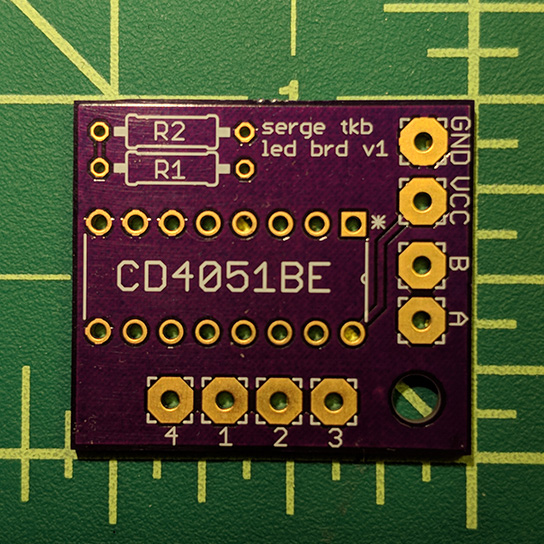

# Serge TKB LED Mod

Small PCB designed to add row indicator LEDs to the Serge TKB (Touch Activated Keyboard Sequencer).  This was designed for The Human Comparator TKB version, which was based on the original Serge TKB schematics.

This repo contains the EAGLE board and schematic files, along with the LTSpice schematic for circuit simulation.

## LED mod PCB 

The LED Mod PCB is small enough to be mounted on the top right corner of the main PCB.

Pads labeled **GND**, **VCC**, **A**, & **B** are wired to the bottom of CD4520BE on the main PCB.  Pads labeled **1**, **2**, **3**, & **4** are wired to the LEDs of sequencer rows A (1), B (2), C (3), and D (4).

Wiring the CD4520BE pins to the LED mod PCB.

### Mounted mod PCB

Two nuts will give enough space between the main PCB and mod PCB for the wires.

### LED wiring

LED anodes are wired to the mod PCB pads **1**-**4**.  LED cathodes are wired to ground.

## BOM

| Value   | QTY | Description | Mouser Part # |
|:--------|:---:|:------------|:--------------|
| CD4051BE | 1 | CMOS Single 8-Channel Analog Multiplexer/Demultiplexer with Logic-Level Conversion | [595-CD4051BE][cd4051] |
| R1 | 1 | 4.99k Resistor |  |
| R2 | 1 | 1.2k Resistor |  |
|  | 4 | Standard LEDs - 3mm Red 25mcd 640nm 40 deg Diffused | [604-WP710A10LSRD][red-leds] |
|  | 4 | LED Lenses Red Fresnel 3mm Lens  | [593-1700R][red-led-lenes] |

[cd4051]: https://www.mouser.com/ProductDetail/595-CD4051BE
[red-leds]: https://www.mouser.com/ProductDetail/604-WP710A10LSRD
[red-led-lenes]: https://www.mouser.com/ProductDetail/593-1700R

## Resources

Serge TKB Schematics:  
<http://machines.hyperreal.org/manufacturers/Serge/schematics/>
